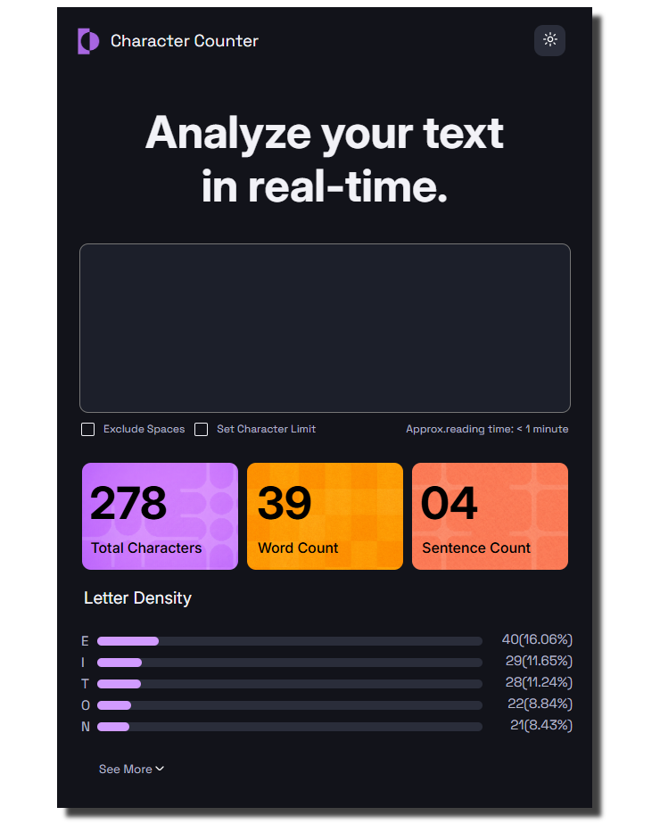

# Proyecto Maquetado 

## Objetivo del proyecto 
El objetivo de este proyecto fue desarrollar lo mejor posible el ejemplo dado. Intentar replicar y llegar a la solución empleando los conocimientos adquiridos hasta el momento.

## ¿Qué tecnología se utilizó?

Además de HTML y CSS, usé páginas como :
- Flaticon
- Microsoft Copilot
- ChatGPT.

## ¿Cómo se organizó el HTML?

Se organizó viendo y analizando la estructura de la imagen a copiar, ver que etiquetas llevar a cabo y cuales eran las más convenientes.

## ¿Cómo se resolvió el CSS?

El CSS se resolvió de forma estructurada y ordenada desde afuera hacia dentro. Con esta metodología es mucho más fácil poder organizarte y llevar el proyecto.

## Dificultades encontradas

Para mí lo más complejo fue el estilar los progress y el checkbox, ahí fue cuando necesité la ayuda de la IA, pero logré entender todo.

# Capturas del resultado

### Vista Desktop:

## Aprendizajes

Durante este proyecto reforcé conocimientos sobre :

- Flexbox
- Posicionamiento de elementos
- Personalización de checkboxes
- Estilización de la etiqueta progress
- Organización de HTML y CSS.

